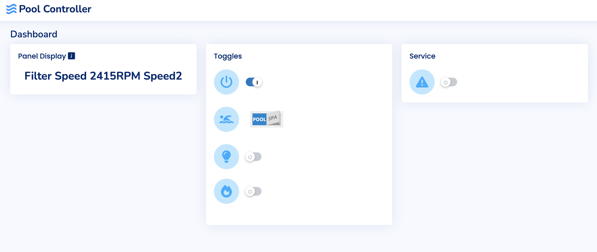
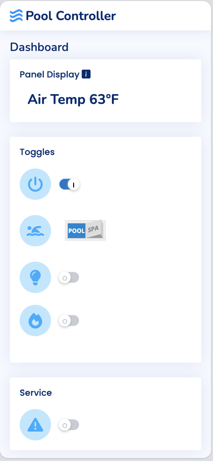

#  Pool-Pi

Pool-Pi is a hardware+software system for interfacing with Goldline/Hayward Aqualogic pool control boards over WiFi via a Raspberry Pi or any basic linux distribution. It adds wireless capabilities to non-wireless control boards and a web interface for viewing updates and sending commands or you can choose to use sockets over TCP with a device such as the EW11 found on Amazon or AliExpress.

    
    

## Demo Video
This video shows multiple clients interfacing with the unit and demonstrates display updates, button presses, menu controls, blinking display characters, and LED updates.

https://user-images.githubusercontent.com/50851884/149863222-32523871-b4b8-4c59-9fa8-fe185a0315eb.mov

## Overview

Pool-Pi provides a web interface which emulates a local PS-8 display, allowing for the same controls accessible from the physical unit. The serial bus exposes all 14 aux relays regardless of local display, so emulation of a PS-16 display is possible, allowing additional relays to be added without purchasing a larger local interface. An RS485 adapter is used to read and send messages in accordance with the [Aqualogic serial communication protocol](/docs/PROTOCOL_NOTES.md), mimicking an OEM device. The system also adds logging, which is unavailable on the OEM unit. The GUI is responsive and will display a easy to read mobile display.

## Setup
Project requirements and instructions can be found in [docs/SETUP.md](/docs/SETUP.md).

## Running
Once you have everything set up, you can run it like this: 
python src/pool-pi.py 11.22.33.44 8811 (for sockets)
pythin src/pool-pi.py /dev/ttyUSB0 (for serial - must be the correct serial port)

## Acknowledgements
Thank you to other people who have put their own resources/solutions for solving this problem online, including [draythomp](http://www.desert-home.com/), [swilson](https://github.com/swilson/aqualogic), and Pete Tompkins.

## Disclaimer
This project is not endorsed or affiliated with Goldline/Hayward in any way.
